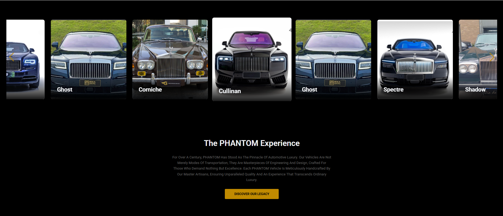

# Phantom - Landing Page de Apresentação




> Uma landing page moderna e imersiva, projetada para apresentar um produto de luxo com elegância e interatividade. Este projeto demonstra habilidades em desenvolvimento front-end com React, SASS e foco em uma experiência de usuário sofisticada.

---

## 🚀 Demo ao Vivo

**[Acesse a demonstração ao vivo aqui!](https://phantom-elegance.vercel.app/)**

---

## ✨ Funcionalidades Principais

- **Design Responsivo:** Experiência de usuário otimizada para desktops, tablets e smartphones.
- **Hero Section Impactante:** Captura a atenção do usuário com um vídeo ou imagem de alta resolução e CTAs claros.
- **Carrossel Interativo:** Galeria de imagens construída com **Swiper.js** para uma navegação fluida e elegante.
- **Componentização com React:** Código organizado em componentes reutilizáveis e de fácil manutenção.
- **Estilização com SASS/SCSS:** Arquitetura de estilos modular, utilizando variáveis, mixins e aninhamento para um CSS limpo e escalável.
- **Mapa Interativo:** Seção de contato com um mapa funcional implementado com **Leaflet**, melhorando a interação do usuário.
- **Animações e Transições:** Efeitos sutis de hover e transições que enriquecem a experiência visual.

---

## 🛠️ Stack de Tecnologias

As seguintes ferramentas e tecnologias foram utilizadas na construção do projeto:

- **React**: Biblioteca principal para a construção da interface.
- **Vite**: Ferramenta de build para um desenvolvimento rápido e otimizado.
- **Sass (SCSS)**: Pré-processador CSS para estilização avançada.
- **Swiper.js**: Para a criação de carrosséis modernos e responsivos.
- **Leaflet**: Biblioteca de mapas interativos.
- **ESLint**: Para garantir a qualidade e a padronização do código.

---

## 🚀 Como Executar o Projeto

Para executar este projeto localmente, siga os passos abaixo.

### Pré-requisitos

- Node.js (versão 18 ou superior)
- npm ou Yarn

### Instalação e Execução

1. **Clone o repositório:**
   ```bash
   git clone https://github.com/seu-usuario/phantom.git
   ```

2. **Navegue até o diretório do projeto:**
   ```bash
   cd phantom
   ```

3. **Instale as dependências:**
   ```bash
   npm install
   ```

4. **Inicie o servidor de desenvolvimento:**
   ```bash
   npm run dev
   ```

5. Abra http://localhost:5173 (ou a porta indicada no seu terminal) para ver o projeto em execução.

---

## 📁 Estrutura do Projeto

A estrutura de arquivos foi pensada para manter o código organizado, escalável e de fácil manutenção, separando responsabilidades:

```
src/
├── assets/           # Imagens, fontes e ícones
├── components/       # Componentes React reutilizáveis
│   ├── Contact/
│   ├── Experience/
│   ├── Footer/
│   ├── Header/
│   ├── Hero/
│   └── Home/
├── styles/           # Arquivos SCSS globais (variáveis, mixins, reset)
├── App.jsx           # Componente raiz que monta as seções
└── main.jsx          # Ponto de entrada da aplicação React
```

---

## 👨‍💻 Autor

Desenvolvido com ❤️ por **Bianca Caetano**, estudante de Engenharia de Software.

[LinkedIn](www.linkedin.com/in/bia-caetano) | [GitHub](https://github.com/bia024/)

---

## 📄 Licença

Este projeto está sob a licença MIT. Veja o arquivo LICENSE para mais detalhes.
